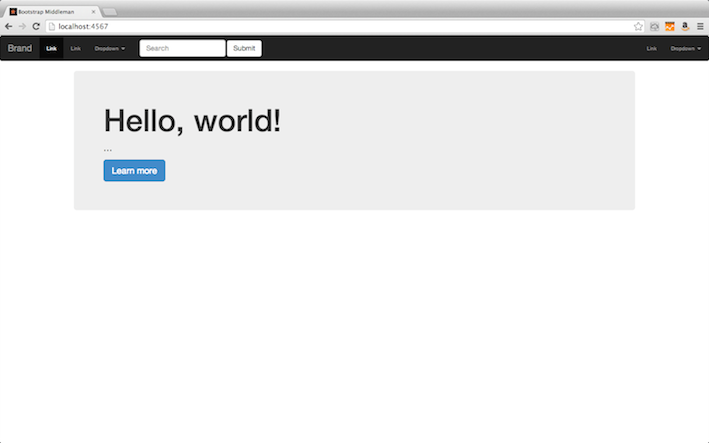

MiddleManにBootstrapを実装
===================

# 目的 #
MiddleManを使ってサイトの作成・更新が出来るようになる。

# 前提 #
| ソフトウェア   | バージョン   | 備考        |
|:---------------|:-------------|:------------|
| OS X           |10.8.5        |             |
| ruby           |2.0.0p0       |             |
| middleman      |3.2.0         |             |
| bootstrap      |3.0.2         |             |

# 構成 #
+ セットアップ
+ ページ作成

# 詳細 #

## セットアップ ##

    $ rvm use ruby-2.0.0-p0
    $ rvm gemset create middleman
    $ rvm use ruby-2.0.0-p0@middleman
    $ gem install middleman
    $ middleman init bootstrap -T=html5
    $ cd bootstrap/
    $ tree
    .
    ├── Gemfile
    ├── Gemfile.lock
    ├── config.rb
    └── source
        ├── 404.html
        ├── LICENSE.md
        ├── README.md
        ├── apple-touch-icon-114x114-precomposed.png
        ├── apple-touch-icon-144x144-precomposed.png
        ├── apple-touch-icon-57x57-precomposed.png
        ├── apple-touch-icon-72x72-precomposed.png
        ├── apple-touch-icon-precomposed.png
        ├── apple-touch-icon.png
        ├── crossdomain.xml
        ├── css
        │   ├── main.css
        │   └── normalize.css
        ├── favicon.ico
        ├── humans.txt
        ├── img
        ├── index.html.erb
        ├── js
        │   ├── main.js
        │   ├── plugins.js
        │   └── vendor
        │       ├── jquery-1.8.0.min.js
        │       └── modernizr-2.6.1.min.js
        ├── layouts
        │   └── layout.erb
        └── robots.txt
    
+ Gemfile

        gem "bootstrap-sass", require: false

+ css/bootstrap_loader.css.scss

        @import "bootstrap";
        @import "bootstrap/theme";

+ js/bootstrap.js

        // Loads all Bootstrap javascripts
        //= require bootstrap/affix
        //= require bootstrap/alert
        //= require bootstrap/button
        //= require bootstrap/carousel
        //= require bootstrap/collapse
        //= require bootstrap/dropdown
        //= require bootstrap/tab
        //= require bootstrap/transition
        //= require bootstrap/scrollspy
        //= require bootstrap/modal
        //= require bootstrap/tooltip
        //= require bootstrap/popover

+ layouts/layout.erb

        <link rel="stylesheet" href="css/bootstrap_loader.css">        
        ....
        
                  

##  ページ作成 ##

+ index.html.erb

        ---
        title: Bootstrap Middleman
        ---

        <!-- Add your site or application content here -->
        <nav class="navbar navbar-inverse" role="navigation">
          <!-- Brand and toggle get grouped for better mobile display -->
          

            <button type="button" class="navbar-toggle" data-toggle="collapse" data-target="#bs-example-navbar-collapse-1">
              Toggle navigation
              
              
              
            </button>
            <a class="navbar-brand" href="#">Brand</a>
          

          <!-- Collect the nav links, forms, and other content for toggling -->
          

            <ul class="nav navbar-nav">
              <li class="active"><a href="#">Link</a></li>
              <li><a href="#">Link</a></li>
              <li class="dropdown">
                <a href="#" class="dropdown-toggle" data-toggle="dropdown">Dropdown <b class="caret"></b></a>
                <ul class="dropdown-menu">
                  <li><a href="#">Action</a></li>
                  <li><a href="#">Another action</a></li>
                  <li><a href="#">Something else here</a></li>
                  <li class="divider"></li>
                  <li><a href="#">Separated link</a></li>
                  <li class="divider"></li>
                  <li><a href="#">One more separated link</a></li>
                </ul>
              </li>
            </ul>
            <form class="navbar-form navbar-left" role="search">
              

                <input type="text" class="form-control" placeholder="Search">
              

              <button type="submit" class="btn btn-default">Submit</button>
            </form>
            <ul class="nav navbar-nav navbar-right">
              <li><a href="#">Link</a></li>
              <li class="dropdown">
                <a href="#" class="dropdown-toggle" data-toggle="dropdown">Dropdown <b class="caret"></b></a>
                <ul class="dropdown-menu">
                  <li><a href="#">Action</a></li>
                  <li><a href="#">Another action</a></li>
                  <li><a href="#">Something else here</a></li>
                  <li class="divider"></li>
                  <li><a href="#">Separated link</a></li>
                </ul>
              </li>
            </ul>
          
<!-- /.navbar-collapse -->
        </nav>

        

         

          <h1>Hello, world!</h1>
            
...

              
<a class="btn btn-primary btn-lg" role="button">Learn more</a>

         

        

# 参照 #

[thomas-mcdonald / bootstrap-sass](https://github.com/thomas-mcdonald/bootstrap-sass)

[README.md update to avoid "An @import loop has been found"](https://github.com/thomas-mcdonald/bootstrap-sass/issues/69)
